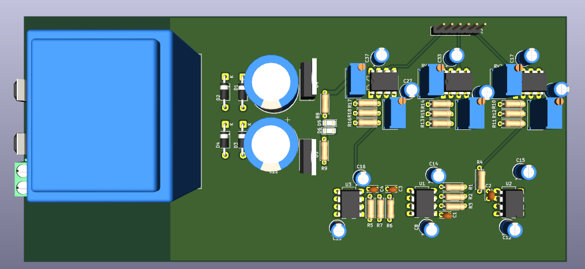
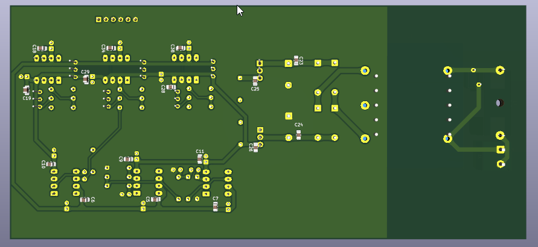

# GERADOR DE ONDAS
Este projeto consiste em uma placa de circuito para geração de formas de onda quadrada, senoidal e triangular. O sistema é composto por uma fonte de alimentação simétrica, um estágio de geração com três amplificadores operacionais e um estágio de amplificação e ajuste de offset, que utiliza outros três amplificadores operacionais.

## Como foi feito?
O projeto foi desenvolvido no KiCad 9.0.4. O processo iniciou-se com a elaboração do esquema elétrico no Editor de Esquemática, seguida pela definição dos valores dos componentes e atribuição de footprints. No Editor de PCI, os elementos foram organizados em duas seções: a área de corrente alternada à esquerda e a de corrente contínua à direita, posicionada após o transformador.

## Por que foi feito?
Este projeto foi desenvolvido para a disciplina de Construção de Dispositivos Digitais do curso de Engenharia da Computação. Embora os circuitos elétricos e a maioria dos footprints tenham sido fornecidos pelo professor, a organização dos componentes, o dimensionamento da placa e o roteamento das trilhas de conexão são os critérios técnicos avaliados no trabalho.

